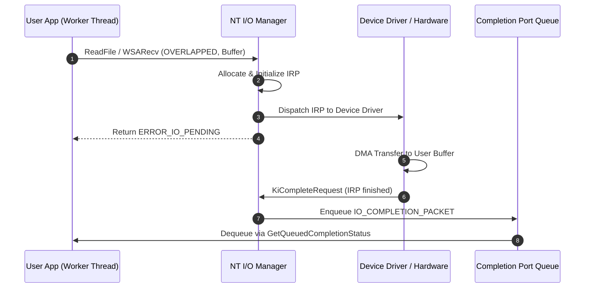
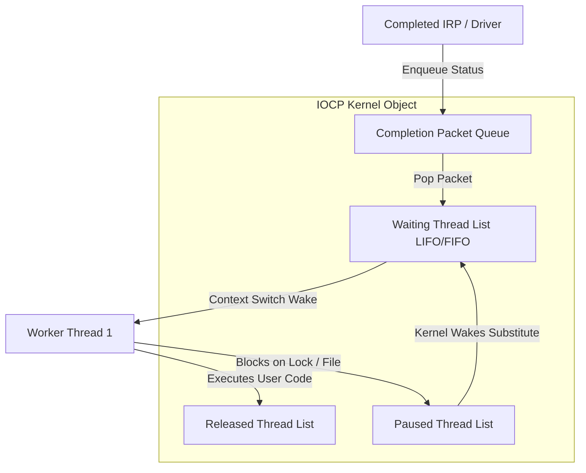

# Inside Windows I/O Completion Ports: Kernel Queues, Overlapped I/O, and Thread Concurrency Mechanics

Linux developers often view asynchronous I/O through the lens of readiness notification engines like epoll, where the OS informs user space that a file descriptor can be read without blocking. Windows NT took a radically different path decades ago by implementing a true proactor model. When an application initiates an I/O operation on Windows, the kernel accepts the buffer immediately, initiates the hardware or network transfer asynchronously, and notifies the application only when the entire payload has already been written into or read from user memory.

At the core of this architecture sits the I/O Completion Port, a kernel object created via CreateIoCompletionPort. IOCP acts as a high-performance multiplexing and dispatch engine capable of driving hundreds of thousands of concurrent I/O operations across a strictly throttled pool of worker threads. Understanding how IOCP works requires looking deep into the NT executive, the lifecycle of I/O Request Packets, and the precise state transitions executed by thread scheduling queues inside the kernel.

## Overlapped I/O and Kernel IRP Lifecycles

Every asynchronous operation bound to an IOCP relies on the OVERLAPPED structure. This memory layout acts as the primary synchronization and data exchange block between user mode and kernel mode.



When an application invokes an async operation such as ReadFile or WSARecv, the NT I/O Manager allocates a kernel structure known as an I/O Request Packet. The IRP stores all context required by device drivers, including pointer references to the user-space target buffer, the byte length requested, the file offset, and a pointer back to the calling process's file object. The calling thread passes an OVERLAPPED pointer to the API call. The kernel writes internal status codes into the Internal and InternalHigh pointer fields of this structure, which represent the NTSTATUS result and the total count of bytes transferred once the operation finishes.

Because the buffer resides directly in user space, the kernel locks those physical pages into memory using Memory Descriptor Lists during direct I/O, or maps them into kernel memory during buffered I/O. Once the IRP is dispatched to the physical hardware or protocol stack driver, the Win32 API returns immediately to user space with ERROR_IO_PENDING. The application is free to execute other work while the network interface card or storage controller performs direct memory access directly into the pinned user buffer.

## Inside the Kernel IOCP Object Structure

When a completion port is allocated, the NT kernel instantiates an executive object wrapping an underlying KQUEUE synchronization object alongside specific IOCP management fields. The kernel maintains four distinct double-linked lists to orchestrate completion packet dispatching and worker thread execution.



The first queue is the Completion Packet Queue. When an IRP finishes execution, the device driver calls KiCompleteRequest, which hands the packet to the I/O Manager. If the target handle is associated with a completion port, the kernel converts the IRP outcome into an IO_COMPLETION_PACKET and appends it to this queue. Each completion packet holds the completion key assigned when binding the handle, the pointer to the original OVERLAPPED structure, the status code, and the total byte count.

The second queue is the Waiting Thread List. Worker threads enter this list by calling GetQueuedCompletionStatus or its vector variant GetQueuedCompletionStatusEx. When no completed packets are waiting in the Completion Packet Queue, worker threads transition out of the running state and block inside this queue.

The third queue is the Released Thread List. This list contains all worker threads that were woken up by the IOCP engine and are currently actively executing user-mode code.

The fourth queue is the Paused Thread List. A thread moves into this list if it was previously released by the IOCP engine but subsequently entered a kernel wait state, such as blocking on a mutex, an uncompleted synchronous file read, or a thread synchronization primitive.

## Thread Concurrency Control and LIFO Scheduling

The most important parameter passed to CreateIoCompletionPort is NumberOfConcurrentThreads. This parameter defines the maximum number of worker threads associated with the port allowed to run simultaneously on CPU cores. Setting this parameter to match the logical CPU core count prevents context switching overhead caused by thread oversubscription.

The NT kernel maintains an exact count of active threads on the Released Thread List. When a new completion packet lands on the Completion Packet Queue, the kernel compares the number of currently running threads against NumberOfConcurrentThreads. If the active thread count equals or exceeds the threshold, the completion packet remains in the Completion Packet Queue, and no waiting threads are woken up. The packet sits safely in kernel memory until one of the currently executing worker threads completes its processing and calls GetQueuedCompletionStatus again.

If a running worker thread encounters a blocking syscall, the OS kernel automatically removes that thread from the Released Thread List and moves it to the Paused Thread List. Recognizing that active CPU throughput has dropped below the target concurrency limit, the kernel immediately wakes up a waiting thread from the Waiting Thread List to process the next packet. When the original thread eventually unblocks and exits the kernel wait, it moves back to the Released Thread List. This briefly allows the running thread count to exceed NumberOfConcurrentThreads, but as soon as any thread finishes its batch of work and re-enters GetQueuedCompletionStatus, the kernel forces it to sleep until the active thread count drops back below the configured limit.

To maximize CPU cache locality, the kernel manages the Waiting Thread List using Last-In, First-Out order under normal load. Waking up the most recently active thread ensures that CPU L1 and L2 cache lines, thread environment blocks, and call stack memory remain warm in the processor caches. If thread execution context switches are minimized and cache lines stay resident, processing millions of completed socket reads yields significantly higher memory bandwidth efficiency than round-robin or FIFO scheduling.

## Native Mechanics and Batch Processing

When an application wants to retrieve completed I/O events, it uses GetQueuedCompletionStatusEx to batch dequeue multiple completions in a single kernel transition. This reduces kernel trap overhead significantly compared to calling single-packet APIs in a loop.

```c
#ifndef UNICODE
#define UNICODE
#endif

#include <winsock2.h>
#include <mswsock.h>
#include <windows.h>
#include <stdio.h>

#pragma comment(lib, "ws2_32.lib")

#define MAX_BATCH_SIZE 64
#define BUFFER_SIZE 8192

typedef struct {
    OVERLAPPED Overlapped;
    SOCKET Socket;
    WSABUF WsaBuf;
    char Buffer[BUFFER_SIZE];
    DWORD Flags;
} IO_CONTEXT;

DWORD WINAPI WorkerThread(LPVOID lpParam) {
    HANDLE hCompletionPort = (HANDLE)lpParam;
    OVERLAPPED_ENTRY entries[MAX_BATCH_SIZE];
    ULONG numEntriesRemoved = 0;

    while (TRUE) {
        BOOL result = GetQueuedCompletionStatusEx(
            hCompletionPort,
            entries,
            MAX_BATCH_SIZE,
            &numEntriesRemoved,
            INFINITE,
            FALSE
        );

        if (!result) {
            DWORD err = GetLastError();
            if (err == WAIT_TIMEOUT) continue;
            break;
        }

        for (ULONG i = 0; i < numEntriesRemoved; i++) {
            ULONG_PTR completionKey = entries[i].lpCompletionKey;
            LPOVERLAPPED pOverlapped = entries[i].lpOverlapped;
            DWORD bytesTransferred = entries[i].dwNumberOfBytesTransferred;

            IO_CONTEXT* ioCtx = (IO_CONTEXT*)pOverlapped;

            if (bytesTransferred == 0) {
                closesocket(ioCtx->Socket);
                HeapFree(GetProcessHeap(), 0, ioCtx);
                continue;
            }

            ioCtx->WsaBuf.len = BUFFER_SIZE;
            ioCtx->Flags = 0;
            ZeroMemory(&(ioCtx->Overlapped), sizeof(OVERLAPPED));

            WSARecv(
                ioCtx->Socket,
                &(ioCtx->WsaBuf),
                1,
                NULL,
                &(ioCtx->Flags),
                &(ioCtx->Overlapped),
                NULL
            );
        }
    }
    return 0;
}
```

Applications can also post synthetic events directly into the completion port using PostQueuedCompletionStatus. This capability turns IOCP into a generalized, ultra-low-latency user-space work dispatching queue. High-performance runtimes like the .NET CLR ThreadPool use this feature to unify socket I/O completions and arbitrary worker task execution onto the same thread context infrastructure.

## IOCP Contrast with Linux Architectural Models

Understanding IOCP highlights why asynchronous architectures differ across modern operating systems. Linux epoll provides readiness notifications where the kernel alerts the process that a socket has data available in kernel ring buffers. The application must then issue a subsequent read system call to copy that data into user space. This readiness model requires two distinct operational phases: waiting for readiness, then executing the synchronous transfer.

Windows IOCP operates as a completion model. The user buffer is provided upfront, and the kernel directly handles the memory transfer via DMA or kernel copy before waking up the user thread. Linux introduced io_uring decades after NT introduced IOCP to bring a true asynchronous completion model to the Linux kernel using shared submission and completion ring buffers. While io_uring achieves zero-syscall overhead by sharing memory structures between kernel and user space, Windows IOCP relies on optimized kernel queue scheduling and LIFO thread wakeups to achieve equivalent sustained throughput across multi-core server environments.
