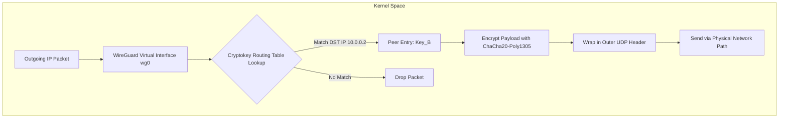
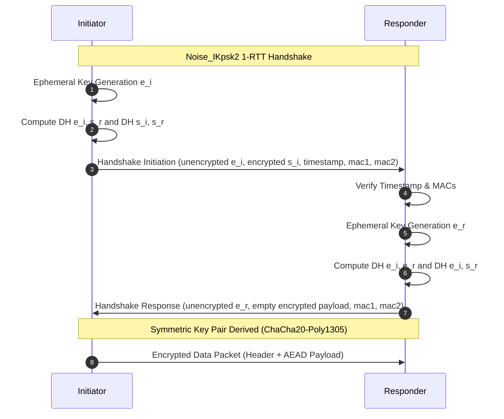
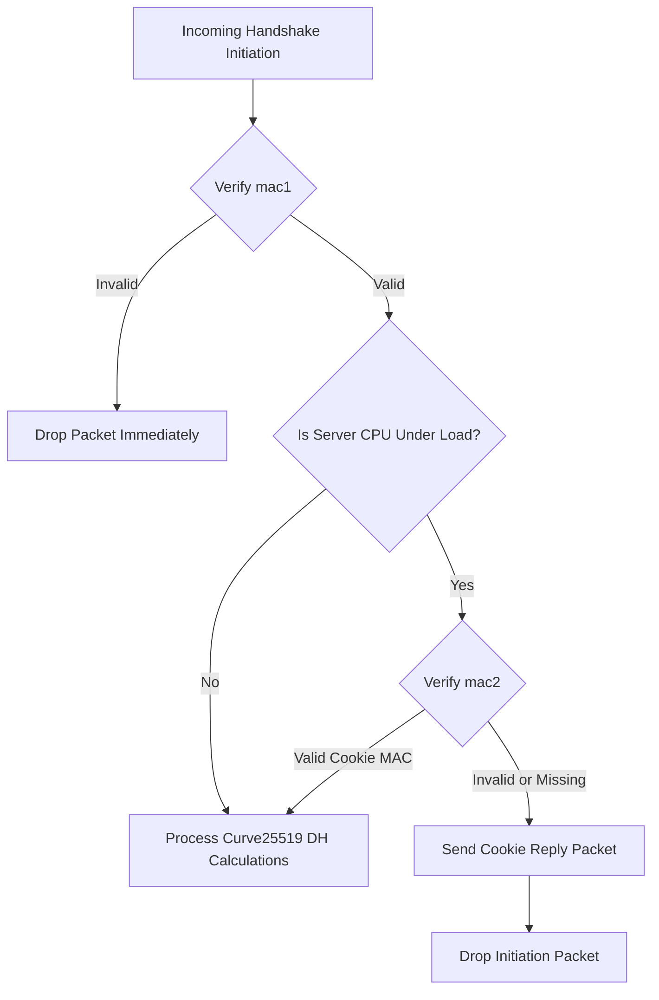

IPsec and OpenVPN represent decades of accumulated enterprise engineering choices that aged into immense complexity. OpenVPN context-switches every packet between kernel network queues and user space TUN devices, taking heavy performance hits. IPsec relies on IKEv2, dragging hundreds of thousands of lines of code along with cipher suite negotiation engines and stateful handshake flows that leave servers vulnerable to simple resource exhaustion attacks. WireGuard discards negotiation entirely. There are no algorithms to choose, no protocol fallback modes, and no multi-stage IKE exchanges. The entire core implementation fits in roughly 4,000 lines of C inside the Linux kernel.

### The Cryptokey Routing Primitive

Traditional network stacks separate routing decisions from cryptographic identity. A standard router looks up a destination IP in a routing table, forwards the packet to a gateway, and leaves encryption to an upper protocol or a separate IPsec policy engine. WireGuard merges routing tables and public key associations into a unified lookup structure.

Every WireGuard interface maintains a table of peers. Each peer is defined by its long-term static public key, a list of allowed IP networks, and an optional remote endpoint socket address.

When an outgoing packet hits the virtual interface, WireGuard inspects the inner IP header to find the destination address. It performs a longest-prefix match against the allowed IPs list across all configured peers. If no peer matches, the packet drops instantly. If a match is found, WireGuard retrieves the peer's symmetric transport key, encrypts the payload using ChaCha20-Poly1305, attaches a 16-byte header containing the receiver's key index, and wraps it in a standard UDP datagram sent to the peer's external socket address.

The reverse operation occurs upon packet reception. When a UDP datagram lands on WireGuard's listening port, WireGuard uses the receiver key index in the header to locate the cryptographic session. After decrypting the payload, it inspects the inner plaintext packet's source IP address. If the inner source IP does not match the allowed IPs mask registered for that authenticated peer, WireGuard drops the packet. This invariant eliminates IP spoofing inside the tunnel. An authenticated peer cannot forge packets pretending to originate from another peer on the network.

### The Noise_IKpsk2 Handshake Engine

WireGuard builds its key exchange on the Noise Protocol Framework, specifically using the Noise_IKpsk2 pattern. In Noise terminology, I indicates that the initiator transmits its static public key immediately in the first message, K means the responder's static key is already known to the initiator, and psk2 specifies a pre-shared key mixed into the final derivation step to provide post-quantum resilience.

Handshakes complete in a single round trip (1-RTT). The initiator transmits a Handshake Initiation message, and the responder replies with a Handshake Response message. Immediately after processing the response, the initiator can transmit encrypted transport packets. The responder can transmit encrypted data as soon as its response message leaves the wire.

The initiator generates a fresh Curve25519 ephemeral keypair. It performs Diffie-Hellman operations between its ephemeral key and the responder's static public key, followed by its static key and the responder's static key. These derived secrets flow through a BLAKE2s HKDF pipeline.

The initiation message carries the initiator ephemeral public key in plaintext, followed by its static public key encrypted with an intermediate key derived from the initial Diffie-Hellman step. It also includes an encrypted TAI64N timestamp payload. The timestamp enforces absolute message ordering and prevents replay attacks. If a responder receives an initiation packet with a timestamp less than or equal to the highest timestamp recorded for that peer, the packet drops.

### Stateless Anti-DoS Mechanics

Asymmetric cryptography demands high CPU cycles. Curve25519 point multiplication requires substantially more computation than simple symmetric decryption. If an attacker spoofs UDP source addresses and floods a WireGuard endpoint with initiation packets, a naive implementation would quickly exhaust its CPU performing useless Diffie-Hellman calculations.

WireGuard stops this attack vector using a dual Message Authentication Code design placed at the tail of every packet header. Every handshake message carries two 16-byte fields named mac1 and mac2.

The mac1 field is always required. It contains a BLAKE2s digest over the packet payload, keyed with the public key of the responder. If mac1 is invalid, the packet drops before hitting any cryptographic code path. This ensures that only packets explicitly directed to the responder's identity cause processing work.

The mac2 field handles high-load states. Under nominal conditions, mac2 is zeroed out. When the responder CPU load or packet queue depth crosses a set threshold, the responder enters cookie mode. Instead of executing full Diffie-Hellman operations for incoming initiation packets, it responds with a tiny stateless cookie reply packet and discards the initiation.

The cookie reply packet contains an encrypted cookie value generated by hashing the initiator's real IP address and port, keyed by a secret random key rotated by the responder every two minutes. Upon receiving a cookie reply, the initiator saves the cookie value. On subsequent handshake initiation attempts, the initiator calculates mac2 as a BLAKE2s digest over the packet including mac1, keyed by this cookie.

When a responder under load receives an initiation packet with a valid mac2, it confirms that the initiator controls the source IP address declared in the UDP header and is willing to process handshake retries. Attack packets carrying spoofed IP addresses fail the mac2 check and drop instantly without touching Curve25519 logic.

### Timer State Machine and Perfect Forward Secrecy

WireGuard sessions do not remain static. To guarantee Perfect Forward Secrecy, symmetric key pairs rotate aggressively. Furthermore, if a peer halts transmission, session state clears cleanly without cluttering network interfaces with keepalive traffic.

A WireGuard session relies on rolling key pairs. Keys are discarded after defined time limits or packet volume caps. A transport key pair expires after 120 seconds or after encrypting 2^64 minus 228 packets, whichever arrives first. After 180 seconds without a successful handshake, all session keys for that peer drop from memory.

The internal timer state machine tracks these boundaries without requiring complex background threads. When an active session encrypts a data packet and discovers that the current key is older than 10 seconds or has processed 1,000,000 packets, it triggers a background handshake initiation while continuing to transmit data on the existing key.

If no outbound data flows, WireGuard stays passive. It does not initiate rekeys over idle connections. If a local peer transmits data and receives no reply within 10 seconds, it sends a zero-length keepalive packet to test the network path. If no response arrives after 5 seconds, it re-initiates the handshake, backing off exponentially up to a maximum attempt limit before tearing down the active key state.

### Kernel Memory and Zero-Copy Execution Paths

Inside the Linux kernel, WireGuard registers as a virtual network device through the standard netdev interface. Outbound packets hit the interface through its `ndo_start_xmit` routine.

Instead of allocating custom tracking buffers or bouncing packets into user space, WireGuard operates directly on kernel `sk_buff` memory allocations. It distributes cryptographic workloads across CPU cores using native kernel workqueues.

When `ndo_start_xmit` takes an outbound packet, it resolves the peer via Cryptokey Routing, attaches a sequential 64-bit nonce, and enqueues the payload into a parallel encryption queue. Per-CPU worker threads execute ChaCha20-Poly1305 encryption simultaneously across available cores. Once encrypted, the payload passes straight to `udp_tunnel_xmit`, bypassing the traditional socket layer lookup entirely and writing the UDP datagram straight down to the IP stack.

Because encryption happens in parallel across kernel worker threads and avoids context switches, WireGuard can saturate 10GbE and 40GbE interfaces with minimal CPU overhead, avoiding the single-threaded bottlenecks typical of legacy VPN daemons.
